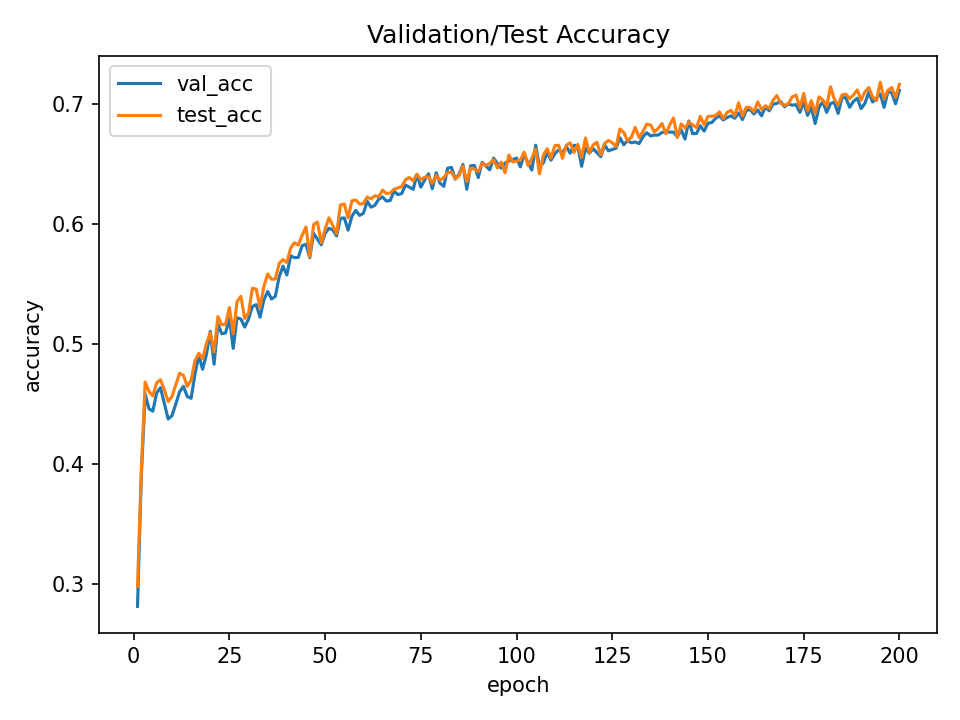
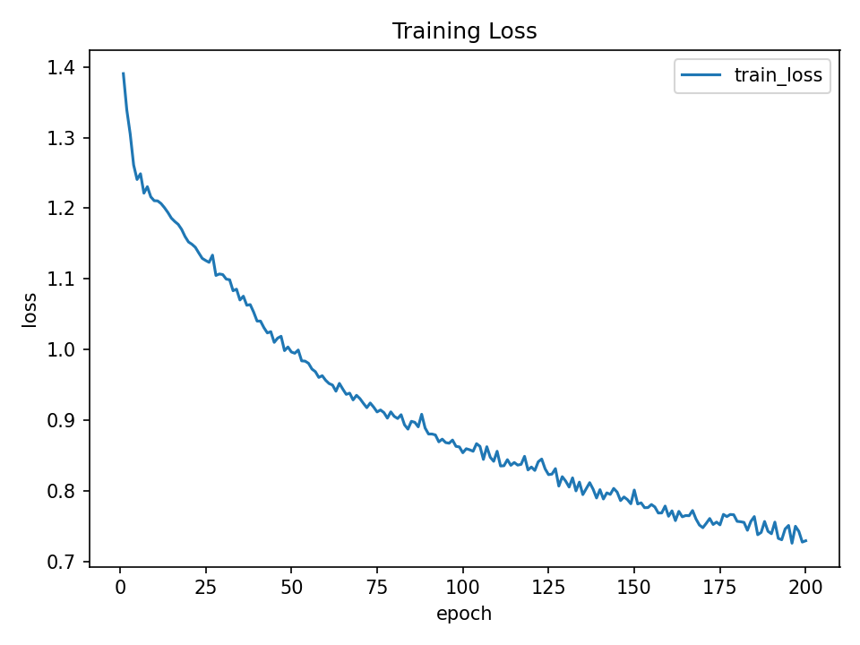
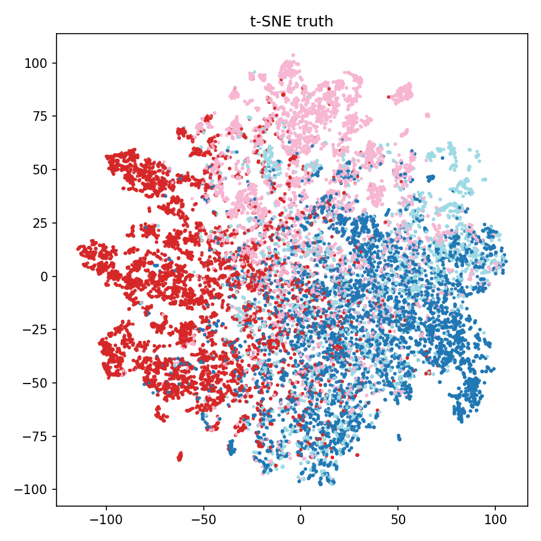
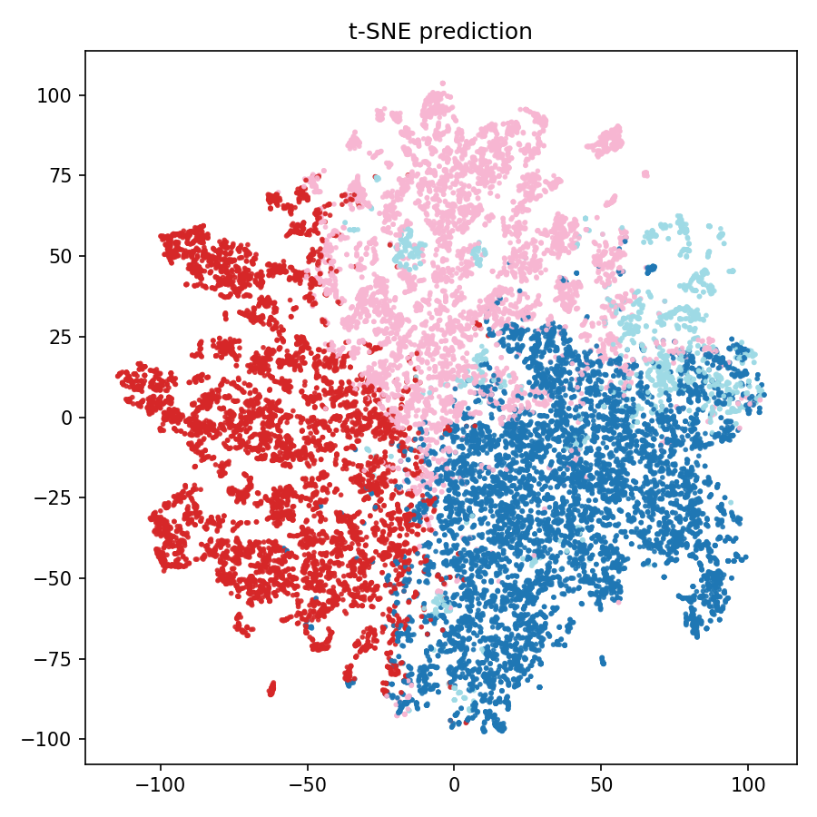
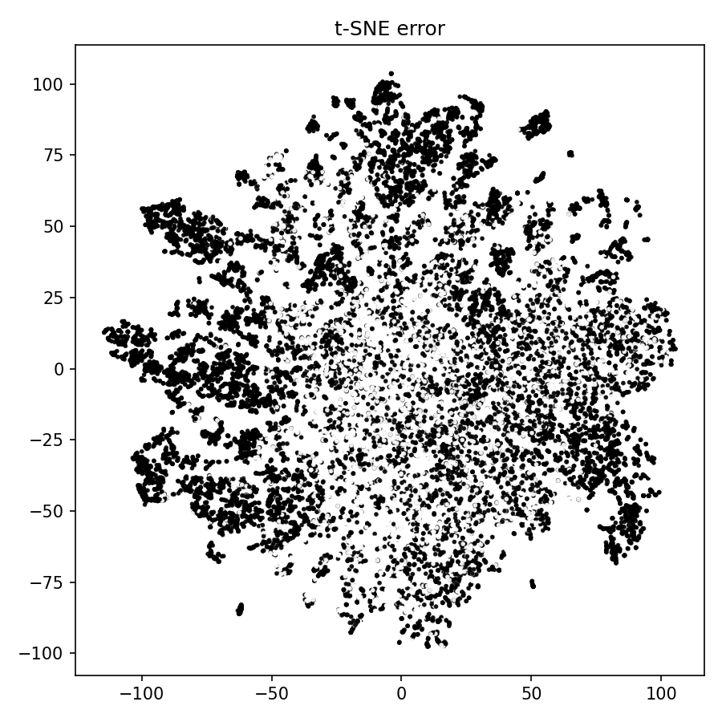
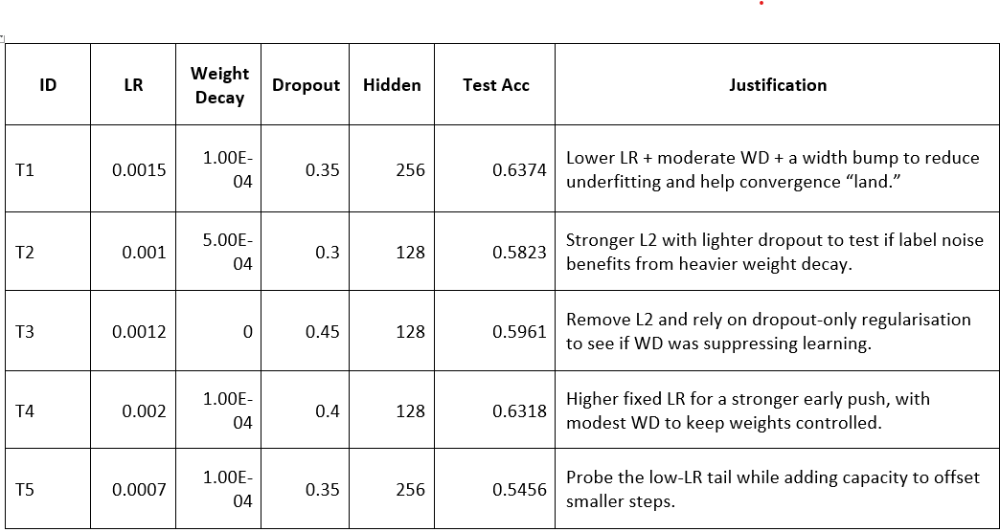
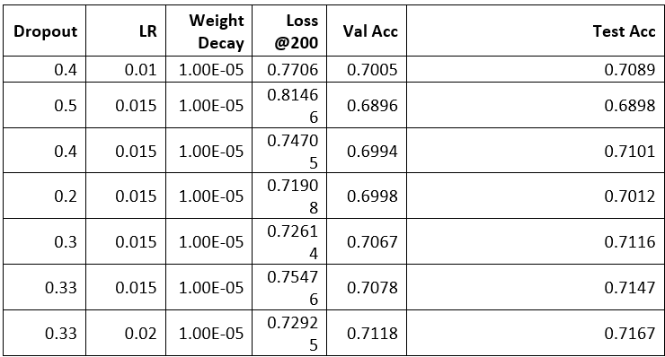

# Recognition Tasks

Predict page category from node features + graph edges. **Metric:** accuracy.

## Final Accuracy
0.7169 test accuracy


## Run

### Training
bash
```python3 train.py```
powershell
```python .\train.py```

### Prediction
bash
```python3 predict.py```
powershell
```python .\predict.py```

## Final hyperparameters
hidden=128, dropout=0.33, lr=0.02, weight_decay=0.0005, epochs=200, seed=1


## Outputs
runs/gnn_facebook.pt best-val checkpoint saved during training
runs/acc_curve.png accuracy vs. epoch
runs/loss_curve.png training loss vs. epoch
runs/tsne_pred.png t-SNE of node embeddings
runs/tsne_gt.png t-SNE of node embeddings
runs/tsne_err.png t-SNE of node embeddings

## Inputs
facebook_large/musae_facebook_edges.csv - edge list with two ID columns
facebook_large/musae_facebook_target.csv - node labels, id plus a label column
facebook_large/musae_facebook_features.json - node features, id - float vector

## Reproducability
seed = 1
split = fixed 60/20/20

## Hardware expectations
less than 2 minutes to train on RTX 3080

# Problem and overview
 
## Problem 
Semi supervised node classification on the Facebook Page Page network. Predict the page category for each node using node features and graph structure. Inputs are a dense feature matrix, an undirected edge list, and train validation test masks. Output is a class label per node. Metric is accuracy. Reasonable accuracy is unknown as the dataset’s class separability is unknown.
Nodes are public pages, edges are known relationships, features are 128 dimensional vectors, some nodes have category labels. A two layer GCN with ReLU and dropout, trained with Adam and weight decay on a 60 20 20 split, achieves test accuracy above 70 percent on an i7 10th gen and RTX 3080 in under five minutes.

## Preprocessing

Preprocessing starts by loading edges, node features, and labels, then putting all node ids into one consistent index so arrays line up. Features are assembled into a single dense matrix with the same column order for every node, trimming or filling as needed so dimensions match the model input. The edge list is converted to integer indices, self loops are dropped, duplicates are removed, and the graph is made undirected so message passing is symmetric.
Next, features are normalized in two steps. A quantile transform reduces skew so no single feature dominates. Row wise L2 normalization scales each node vector to unit length, which keeps gradients stable during aggregation. Labels are mapped to integers with unknowns set to minus one, so unlabelled nodes influence neighbours without contributing to the loss. A fixed 60 20 20 train validation test split is created over labelled nodes with a set seed to provide enough supervision, a clean validation set for model selection, and a held out test set for reporting.

## Model

Architecture. Two GCN layers with ReLU between them, dropout for regularization, and a final linear layer to produce class scores. Full batch training on the single graph keeps the pipeline simple and fast to run. 
Rationale. This depth avoids over smoothing while still passing information across immediate neighbourhoods. Alternatives like deeper stacks, GraphSAGE, or GIN add tuning overhead with limited return on this dataset. Dropout and light weight decay are sufficient regularization without batch norm or schedulers. 

## Training

Use cross entropy loss on train mask nodes and Adam with a fixed learning rate and light weight decay. Train in full batch for a set number of epochs. After each epoch switch the model to eval to disable dropout, compute validation and test accuracy using their masks, and track the best validation score. Save the checkpoint when validation improves so the final report uses the best model rather than the last epoch.
Log loss and accuracy each epoch to a csv and render loss and accuracy curves at the end. Fix a random seed for the split and for torch so runs are comparable. This setup gives stable optimisation, selection via validation, reproducible numbers, and plots that show whether the model is learning, overfitting, or plateauing.

## Prediction and visualisation

Load the graph and best checkpoint, set the model to eval (dropout off), forward for logits, argmax for labels, and compute accuracy on the test mask. Grab penultimate-layer embeddings in eval so they’re stable. Record the scalar test accuracy to match the training log.
Run t-SNE once on embeddings of labelled nodes and reuse the 2D coords. Make three plots with the same layout/axes: colour by ground truth, colour by predictions, and an error map highlighting misclassified nodes. Alignment of the first two shows separation; errors cluster at class boundaries or sparse regions, indicating overlap or weak neighbourhood signal.

## Results

The test table shows very low learning rates and heavy weight decay underperform, removing weight decay hurts, and widening to 256 does not help at those rates.

Therefore the search table searches for the best combination of dropout and learning rate with hidden fixed at 128 and weight decay at 1e minus 5, because Phase 1 indicated moderate capacity and light L2 are sound defaults and the main gains now come from tuning regularisation strength and step size.
 
The final best parameters were found to be hidden 128, dropout 0.33, learning rate 0.02, weight decay 1e-5, with a test accuracy of 0.7167. 

### t-SNE truth
There are three clear lobes: two partly overlapping on the right and a red-dominant lobe on the left. Boundaries are fuzzy, so classes mix along the seams. This means the embeddings reflect community structure but are not separable. Should be noted separation is strongest in lobe cores and weakest where lobes meet.

### t-SNE prediction

Decision regions line up with those lobes: interiors are confidently classified, while borders follow the same overlap as the truth plot. It looks sharper than the truth, indicating high confidence in cluster cores and uncertainty at interfaces. Embeddings come from the second GCN layer.
### t-SNE error

Errors concentrate on the same interface bands and among a few isolated points. Cluster interiors are mostly correct. It seems there are mixed neighbourhoods or low-degree nodes that provide weak, conflicting signals and push predictions off the true class.

### Training loss

Loss falls smoothly from about 1.39 to 0.74 over 200 epochs with only small stochastic noise. The steady descent suggests the learning rate and regularisation are well-tuned, and optimisation is stable with diminishing returns near the end.

### Validation/Test accuracy

Both curves climb to 0.71–0.72 and stay close throughout, leaving a very small generalisation gap. The early rapid gains taper into a slow, consistent rise, and selecting the best-val checkpoint avoids any late-epoch drift.


### Takeaway 
The GCN captures the graph’s community structure. most remaining mistakes are inherently ambiguous boundary nodes rather than training instability. 


## Conclusion


The model was **partly successful**. It captured useful community structure and reached roughly 0.72 test accuracy but t-SNE shows overlapping classes and boundary errors that limit separability.

The model **can be improved** by adding richer features (text or node2vec), tuning regularisation (LR/WD/dropout, early stopping), trying GNN variants (GraphSAGE/GIN, residuals), and refining graph prep (dedup/weights or a k-NN feature graph).


## Figures







[metrics.csv](runs/metrics.csv)


## Dependencies
python>=3.11
torch>=2.4
torch-geometric>=2.5
numpy>=1.26
pandas>=2.2
scikit-learn>=1.5
matplotlib>=3.8

## References
DataCamp. (2022, July 21). A comprehensive introduction to graph neural networks (GNNs). https://www.datacamp.com/tutorial/comprehensive-introduction-graph-neural-networks-gnns-tutorial

DataCamp. (2024, December 9). Introduction to t-SNE: Nonlinear dimensionality reduction and data visualization. https://www.datacamp.com/tutorial/introduction-t-sne

PyTorch Geometric Team. (2024). Introduction by example (v2.6.1). PyTorch Geometric documentation. https://pytorch-geometric.readthedocs.io/en/2.6.1/get_started/introduction.html

PyTorch Geometric Team. (2024). Creating graph datasets (v2.5.3). PyTorch Geometric documentation. https://pytorch-geometric.readthedocs.io/en/2.5.3/notes/create_dataset.html

Stanford Network Analysis Project. (n.d.). Facebook Large Page-Page Network. SNAP. Retrieved October 31, 2025, from https://snap.stanford.edu/data/facebook-large-page-page-network.html